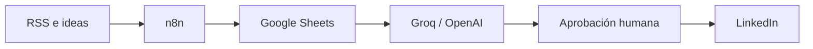

# Automatización de LinkedIn con n8n

Sistema open source para idear, revisar, programar y publicar contenido en LinkedIn con **n8n**, Google Sheets e IA. Mantiene una aprobación humana deliberada: la IA prepara el borrador y una persona decide qué se publica.

**[Abrir la documentación web](https://viniciorm.github.io/post-automatic-linkedin-n8n/)**

## Qué incluye

- Ideador corporativo a partir de noticias RSS.
- Ideador personal a partir de ideas y experiencias propias.
- Revisión y programación editorial en Google Sheets.
- Publicación en perfiles personales y páginas de organización.
- Generación de texto con Groq y contingencia controlada con OpenAI.
- Documentación web responsive, buscador, diagramas Mermaid y modo oscuro.

## Arquitectura



El contenido avanza por cuatro estados: `GENERAR` → `REVISANDO` → `APROBADO` → `PUBLICADO`.

## Workflows principales

| Archivo | Propósito |
| --- | --- |
| `Workflow_A_Ideador_Empresa.json` | Genera contenido corporativo desde RSS. |
| `Workflow_B_Publicador_LinkedIn.json` | Publica contenido corporativo aprobado. |
| `Workflow_C_Ideador_Publicador_Personal.json` | Genera y publica contenido personal. |

La variante `Workflow_B_Publicador_LinkedIn_Organizacion.json` se conserva como referencia y no debe activarse junto al publicador principal.

## Documentación web

La web consume directamente [`docs/MANUAL_AUTOMATIZACION_LINKEDIN_N8N.md`](docs/MANUAL_AUTOMATIZACION_LINKEDIN_N8N.md), por lo que el manual y el sitio mantienen una sola fuente de verdad.

```powershell
cd web
npm install
npm run dev
```

Abre `http://127.0.0.1:5173`. Para generar la versión de producción:

```powershell
npm run build
```

## Puesta en marcha

1. Copia los workflows que utilizarás.
2. Reemplaza los marcadores `YOUR_*` con tus propios identificadores dentro de n8n.
3. Configura las credenciales de Google Sheets, LinkedIn, Groq y Hugging Face desde el gestor de credenciales de n8n.
4. Crea las pestañas `Hoja 1` e `Ideas Personales` con las columnas descritas en el manual.
5. Prueba manualmente con una sola fila antes de activar cualquier workflow.

Consulta el [manual completo](docs/MANUAL_AUTOMATIZACION_LINKEDIN_N8N.md) para conocer la instalación, estructura de Sheets, pruebas, errores conocidos y operación segura.

## Seguridad

- Nunca guardes tokens, API keys, secretos OAuth ni archivos de cuentas de servicio en el repositorio.
- Las exportaciones incluidas usan marcadores para IDs privados y referencias de credenciales.
- No utilices el estado `APROBADO` durante una prueba si no estás dispuesto a publicar realmente.
- Revisa y rota cualquier credencial que haya sido expuesta previamente.

## Licencia

Distribuido bajo la [licencia MIT](LICENSE).
