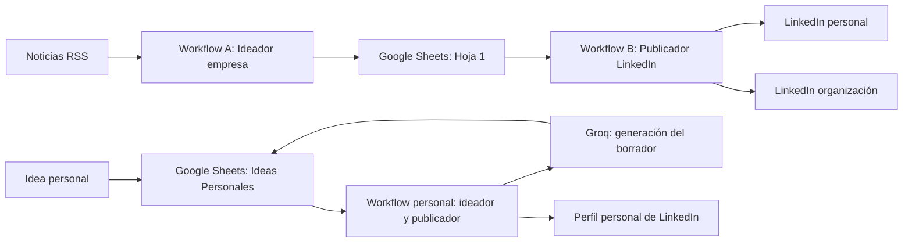
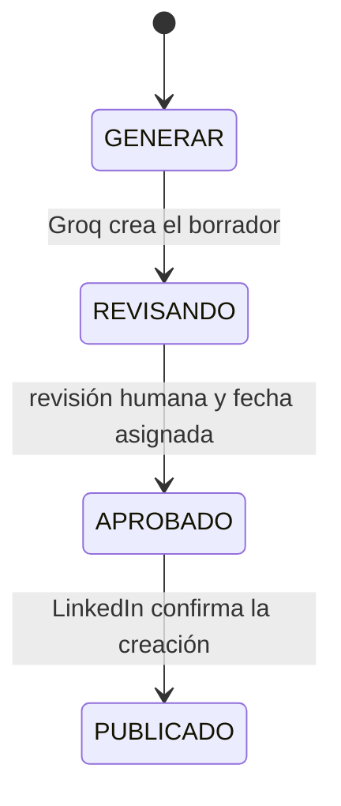

# Manual de automatización de LinkedIn con n8n

> Documento vivo. Resume la implementación, las pruebas y los errores encontrados hasta el 19 de junio de 2026. Debe actualizarse a medida que evolucione la solución.

## 1. Objetivo

Construir un sistema en n8n que permita:

- generar borradores para la página de una empresa a partir de noticias;
- generar publicaciones personales a partir de ideas propias;
- revisar y aprobar cada contenido en Google Sheets;
- publicar solamente las filas aprobadas y programadas;
- elegir entre perfil personal y página de organización;
- mantener voces editoriales diferentes para la empresa y la persona.

La aprobación humana es deliberada: la IA propone, pero una persona revisa el contenido antes de publicarlo.

## 2. Arquitectura actual



### Workflows

| Workflow | Archivo | Función |
| --- | --- | --- |
| Ideador de empresa | `Workflow_A_Ideador_Empresa.json` | Lee noticias, genera el contenido corporativo y lo guarda para revisión. |
| Publicador de empresa | `Workflow_B_Publicador_LinkedIn.json` | Lee filas aprobadas y las dirige al perfil personal o a la organización. |
| Ideador y publicador personal | `Workflow_C_Ideador_Publicador_Personal.json` | Convierte ideas propias en borradores con voz personal y publica los aprobados. |

La variante `Workflow_B_Publicador_LinkedIn_Organizacion.json` se conserva como referencia, pero no debe activarse junto al publicador principal porque podría duplicar publicaciones.

## 3. Requisitos

### Infraestructura

- Docker Desktop.
- n8n accesible localmente.
- Una cuenta de Google con acceso al spreadsheet.
- Una aplicación de LinkedIn con OAuth configurado.
- Una cuenta de Groq y su credencial en n8n.
- Un token de Hugging Face si se utilizará generación de imágenes.
- Zona horaria de n8n: `America/Santiago`.

### Credenciales necesarias en n8n

- Google Sheets OAuth2.
- LinkedIn OAuth2 para el perfil personal.
- LinkedIn OAuth2 con permisos administrativos para publicar como organización.
- Groq API.
- Variable de entorno `HUGGINGFACE_API_TOKEN` para imágenes.

La API key administrativa de n8n puede guardarse como variable de usuario `N8N_API_KEY`. No debe escribirse en el workflow, en archivos versionados ni en capturas públicas.

## 4. Preparación de Google Sheets

Se utiliza un spreadsheet con dos pestañas.

### 4.1. Hoja 1: contenido de empresa

Columnas esperadas:

```text
ID	Etapa Funnel	Tema / Título	RRSS	Tipo de Post	Destino LinkedIn	Copy Sugerido	Prompt Visual	CTA	Fecha Publicacion	Estado	Link Noticia
```

Valores importantes:

- `RRSS`: `LinkedIn`.
- `Tipo de Post`: `POST`.
- `Destino LinkedIn`: `Personal` u `Organizacion`.
- `Estado`: `REVISANDO`, `APROBADO` o `PUBLICADO`.

### 4.2. Ideas Personales

Columnas esperadas:

```text
ID	Idea Base	Mi Opinion	Experiencia	Objetivo	Formato	Copy Personal	Prompt Visual	Fecha Publicacion	Estado	Link Referencia
```

Descripción práctica:

| Columna | Uso |
| --- | --- |
| `ID` | Puede quedar vacía al crear la idea. El workflow genera un identificador. |
| `Idea Base` | Tema principal que se quiere desarrollar. |
| `Mi Opinion` | Punto de vista propio que debe respetar la IA. |
| `Experiencia` | Experiencia real relacionada. Si está vacía, el prompt prohíbe inventarla. |
| `Objetivo` | Intención: reflexión, aprendizaje, invitación, debate, etc. |
| `Formato` | `TEXTO` o `IMAGEN`. |
| `Copy Personal` | Borrador generado y editable. |
| `Prompt Visual` | Descripción en inglés para generar una imagen. |
| `Fecha Publicacion` | Fecha en `DD/MM/YYYY` o `YYYY-MM-DD`. |
| `Estado` | Controla el ciclo del contenido. |
| `Link Referencia` | Fuente opcional para respaldar la idea. |

## 5. Ciclo de vida del contenido



Reglas:

1. `GENERAR`: solicita un nuevo borrador.
2. `REVISANDO`: permite corregir el copy, el formato y el prompt visual.
3. `APROBADO`: autoriza la publicación cuando la fecha coincide con el día actual.
4. `PUBLICADO`: se asigna solamente después de que LinkedIn responde correctamente.

Para volver a generar una idea, debe revisarse cuidadosamente el estado y el ID para evitar duplicados.

## 6. Instalación y configuración

1. Iniciar n8n y comprobar que responde en `http://localhost:5678`.
2. Importar los tres archivos JSON indicados en la sección de arquitectura.
3. Seleccionar las credenciales correctas en todos los nodos de Google Sheets, Groq y LinkedIn.
4. Cambiar el identificador del spreadsheet en todos los nodos si se utiliza una copia nueva.
5. Confirmar los nombres exactos de las pestañas: `Hoja 1` e `Ideas Personales`.
6. Configurar la zona horaria `America/Santiago`.
7. Mantener los workflows inactivos durante las pruebas manuales.
8. Ejecutar primero con una sola fila de prueba.

No se deben activar simultáneamente dos publicadores que lean la misma pestaña y los mismos estados.

## 7. Primera prueba de una publicación personal

### Generar el borrador

1. Crear una fila en `Ideas Personales`.
2. Dejar `ID` vacío.
3. Completar `Idea Base`, `Mi Opinion`, `Objetivo` y, si corresponde, `Experiencia`.
4. Definir `Formato` como `TEXTO`.
5. Escribir `GENERAR` en `Estado`.
6. Ejecutar manualmente el workflow personal.
7. Comprobar que se completaron `ID`, `Copy Personal` y `Prompt Visual`.
8. Confirmar que el estado cambió a `REVISANDO`.

### Aprobar y publicar

1. Leer y editar el copy generado.
2. Escribir la fecha del día en `Fecha Publicacion`.
3. Cambiar `Estado` a `APROBADO`.
4. Ejecutar nuevamente el workflow.
5. Comprobar que el flujo pasa por `Filtrar ideas APROBADAS`, `Elegir formato` y el nodo de LinkedIn correspondiente.
6. Confirmar que la fila cambia a `PUBLICADO`.

Una respuesta como `urn:li:share:123...` confirma que LinkedIn creó la publicación. Puede abrirse con esta estructura:

```text
https://www.linkedin.com/feed/update/urn:li:share:IDENTIFICADOR/
```

## 8. Voz personal y formato editorial

La voz personal se derivó de publicaciones reales guardadas en `publicaciones_linkedin_vini_reyes.txt`. Su perfil editorial está documentado en `docs/VOICE_PERSONAL_VINI_REYES.md`.

Principios aplicados:

- tono profesional, cercano, reflexivo y práctico;
- contexto antes de la opinión;
- primera persona sólo cuando existe una opinión o experiencia real;
- sin experiencias, cifras ni credenciales inventadas;
- sin tono corporativo ni clichés de venta;
- cierre abierto y natural;
- uso moderado de emojis y hashtags.

El nodo `Parsear copy personal` incorpora un formateador preventivo. Si el modelo entrega un bloque continuo, lo divide en párrafos de una o dos frases, separa las preguntas y conserva una línea final de hashtags. Esto evita el “muro de texto” en LinkedIn.

### Voz de la organización

El ideador de empresa está orientado exclusivamente a publicaciones de LinkedIn. La voz de Tu Partner TI debe aportar contexto y criterio técnico antes de plantear una oportunidad comercial.

La intensidad comercial depende del funnel:

- `TOFU`: informa y abre una conversación específica, sin ofrecer servicios.
- `MOFU`: transforma la noticia en criterios de evaluación y puede invitar a revisar una decisión o riesgo.
- `BOFU`: explica de manera directa y sobria cómo Tu Partner TI puede ayudar ante una necesidad concreta.

El funnel no debe asignarse como TOFU por defecto ni distribuirse de forma artificial. Se elige según la cercanía entre la noticia y una decisión real de negocio. Cada copy debe tener entre 160 y 260 palabras, párrafos breves, un solo cierre y entre tres y cinco hashtags específicos.

El campo `CTA` conserva el mismo cierre incluido dentro de `Copy Sugerido`. El publicador envía únicamente `Copy Sugerido`, por lo que el cierre debe estar incorporado en el texto y no depender de una concatenación posterior.

## 9. Errores encontrados y soluciones

### 9.1. El flujo se detenía en `Filtrar ideas APROBADAS`

**Síntoma:** el nodo recibía una fila, pero devolvía cero elementos.

**Causa:** Google Sheets entregaba la fecha como `18/06/2026`, mientras el código esperaba `2026-06-18`.

**Solución:** se agregó `normalizeDate()` al filtro para aceptar `DD/MM/YYYY` y `YYYY-MM-DD`.

**Comprobación:** el nodo debe devolver `1 item` cuando coinciden estado, fecha, formato y copy.

### 9.2. n8n seguía mostrando el código antiguo

**Síntoma:** la API había actualizado el workflow, pero el editor abierto ejecutaba la versión anterior.

**Causa:** el navegador conservaba una copia sin actualizar del workflow.

**Solución:** no guardar la pestaña antigua, recargar con `Ctrl + F5` y descartar los cambios locales si n8n lo pregunta.

### 9.3. LinkedIn devolvía `Requested version 20250401 is not active`

**Síntoma:** error HTTP `426 NONEXISTENT_VERSION` en el nodo LinkedIn.

**Causa:** el nodo incluido en n8n `2.9.4` tenía escrita directamente la cabecera:

```text
LinkedIn-Version: 202504
```

LinkedIn ya no aceptaba esa versión.

**Solución aplicada al entorno local:** se respaldó `GenericFunctions.js`, se reemplazó `202504` por `202601` y se reinició el contenedor `n8n-automation`. Después del reinicio, `/healthz` respondió `ok`.

**Advertencia importante:** esta modificación vive dentro del contenedor. Se conserva después de un reinicio normal, pero puede perderse si el contenedor se elimina, se recrea o se actualiza la imagen.

**Solución recomendada a largo plazo:**

1. actualizar n8n a una versión cuyo nodo LinkedIn use una versión vigente; o
2. reemplazar los nodos LinkedIn por nodos HTTP Request que controlen explícitamente `LinkedIn-Version`.

Antes de cambiar la versión de n8n, se debe respaldar el volumen y exportar los workflows.

### 9.4. El flujo terminaba, pero la publicación no aparecía inmediatamente

**Síntoma:** n8n mostraba ejecución exitosa y la fila cambiaba a `PUBLICADO`, pero el post no aparecía a primera vista.

**Diagnóstico:** LinkedIn había devuelto un URN válido, por lo que el post sí existía.

**Solución:** abrir el enlace construido con el URN, revisar `Actividad → Publicaciones` y confirmar que se está mirando el perfil OAuth correcto. El feed puede demorar en reflejar una publicación nueva.

### 9.5. El texto se publicaba como un solo bloque

**Síntoma:** el contenido era legible, pero visualmente aparecía como un párrafo largo.

**Causa:** el modelo entregó el copy sin saltos de línea y el nodo LinkedIn respetó ese texto.

**Solución:** se agregó un formateador al nodo `Parsear copy personal` para introducir separaciones seguras antes de guardar el borrador.

### 9.6. Credencial de Google revocada o inválida

**Síntoma:** los nodos de Google Sheets no podían leer o actualizar filas.

**Solución:** volver a conectar `Google Sheets OAuth2` desde n8n y probar primero un nodo de lectura. No reutilizar archivos de cuenta de servicio inválidos ni publicar sus claves.

### 9.7. Groq rechazaba el lote por exceso de solicitudes o tokens

**Síntoma:** el nodo `AI Agent` fallaba después de generar varias publicaciones con el mensaje `The service is receiving too many requests from you`.

**Causa:** los tres RSS entregaban cerca de 80 noticias. Aunque el loop esperaba entre llamadas, una ejecución llegó a procesar 19 contenidos y agotó el límite diario de tokens de Groq. Una espera no resuelve un límite diario.

**Solución:** el nodo `Seleccionar lote editorial` reduce cada ejecución a tres noticias tecnológicas relevantes, idealmente una por fuente. El loop espera diez segundos entre contenidos. Esto reduce el consumo y evita generar decenas de borradores en un día.

### 9.8. Todas las publicaciones quedaban como MOFU

**Causa:** cada noticia se clasificaba de forma aislada y el modelo tendía a repetir la categoría más segura.

**Solución:** cada lote recibe tres objetivos editoriales: un TOFU, un MOFU y un BOFU. El objetivo se entrega al modelo y se valida antes de guardar la fila. La distribución es una decisión editorial del lote, no una clasificación aleatoria.

### 9.9. Google Sheets creaba filas con campos vacíos

**Causa:** el modelo podía devolver hashtags fuera del objeto JSON. Las expresiones `JSON.parse($json.output)` no obtenían todos los campos, pero la operación de Sheets alcanzaba a crear la fila.

**Solución:** `Validar respuesta IA` extrae y analiza el JSON, recupera hashtags externos y comprueba `funnel`, `titulo`, `copy`, `visual_prompt` y `cta`. Si falta un campo, detiene esa escritura con un error explícito en lugar de crear una fila incompleta.

### 9.10. Contingencia con OpenAI cuando Groq agota su cuota

Groq continúa como proveedor principal. El nodo `AI Agent` envía su salida normal a validación, pero su salida de error pasa por `Autorizar contingencia OpenAI`.

La contingencia sólo se autoriza si el error contiene señales de cuota o rate limit, como `429`, `rate limit`, `tokens per day` o `too many requests`. Los errores de configuración, credenciales o formato no activan OpenAI y deben corregirse.

Cuando se autoriza, `OpenAI contingencia` utiliza `gpt-4.1-mini` con una credencial almacenada en n8n. La respuesta pasa por el mismo nodo `Validar respuesta IA` que Groq, por lo que mantiene el esquema, el funnel asignado y la protección contra filas incompletas. La API key nunca se guarda dentro del workflow.

### 9.11. n8n bloqueaba el token de Hugging Face en el nodo HTTP

**Síntoma:** el generador de imágenes fallaba con `access to env vars denied` al evaluar `$env.HUGGINGFACE_API_TOKEN`.

**Causa:** n8n bloquea el acceso a variables de entorno dentro de nodos y el token tampoco estaba configurado en el contenedor.

**Solución:** se creó una credencial nativa `Hugging Face API` en n8n y los generadores de imagen corporativo y personal utilizan `predefinedCredentialType`. El encabezado `Authorization` ya no se construye manualmente y el token no se guarda en los JSON.

### 9.12. LinkedIn rechazaba la publicación como organización

**Síntoma:** el nodo LinkedIn devolvía `Organization permissions must be used when using organization as owner`.

**Causa:** la credencial disponible era de tipo personal y la aplicación de LinkedIn todavía tenía `Community Management API` en estado `Review in progress`. Sin la aprobación, LinkedIn no concede `w_organization_social` y no permite publicar como página.

**Acción pendiente:** esperar la aprobación del producto, crear una credencial `LinkedIn Community Management OAuth2 API` y conectarla únicamente al nodo de organización. Si el OAuth local no acepta `localhost`, realizar la autorización mediante la futura URL HTTPS de la VPS o un túnel temporal.

Se probó un Quick Tunnel de Cloudflare para OAuth y luego se eliminó. El contenedor original quedó restaurado en `http://localhost:5678`.

### 9.13. Groq devolvía JSON inválido en el copy personal

**Síntomas:** el nodo `Parsear copy personal` fallaba con `Bad control character in string literal` o con `Unexpected non-whitespace character after JSON`.

**Causas:** el modelo podía incluir saltos de línea sin escapar dentro de `copy` o agregar Markdown y explicaciones después del objeto JSON válido.

**Solución:** el nodo ahora localiza el primer objeto JSON completo mediante balanceo de llaves, ignora cualquier contenido posterior y escapa retornos, tabulaciones y saltos de línea que aparezcan dentro de strings. Después valida que `copy` exista antes de aplicar el formateador para LinkedIn. El código fuente del nodo también se conserva en `scripts/nodes/parsear-copy-personal.js`.

**Comprobación:** al ejecutar la generación, `Parsear copy personal` debe devolver `copy` y `visual_prompt`; la fila cambia a `REVISANDO`. Si Groq no entrega un objeto completo o no incluye un copy válido, el flujo se detiene con un error descriptivo antes de guardar o publicar.

## 10. Operación segura

Antes de activar un workflow:

- ejecutar una prueba manual con una única fila;
- comprobar el perfil o la organización seleccionada;
- revisar el texto, los enlaces y las menciones;
- confirmar la fecha y la zona horaria;
- verificar que sólo exista un publicador activo para esa hoja;
- confirmar que una respuesta fallida de LinkedIn no marque la fila como publicada;
- conservar una copia exportada de cada workflow funcional.

No se debe usar `APROBADO` como estado de prueba si no se está dispuesto a publicar realmente.

## 11. Migración a n8n en VPS

La instancia de producción utiliza `https://n8n.tupartnerti.cl`. Los IDs de Google Sheets no cambian durante la migración; las credenciales OAuth sí deben volver a autorizarse en la nueva instancia.

### 11.1. Proxy confiable y WebSocket

Cuando existe un proxy inverso se debe configurar `N8N_PROXY_HOPS=1`. Sin esta variable puede aparecer `ERR_ERL_UNEXPECTED_X_FORWARDED_FOR`.

El bloque Nginx debe conservar la conexión WebSocket:

```nginx
location / {
    proxy_pass http://localhost:5678;
    proxy_http_version 1.1;
    proxy_buffering off;
    proxy_cache off;
    proxy_set_header Upgrade $http_upgrade;
    proxy_set_header Connection "upgrade";
    proxy_read_timeout 3600s;
    proxy_send_timeout 3600s;
    proxy_set_header Host $host;
    proxy_set_header X-Real-IP $remote_addr;
    proxy_set_header X-Forwarded-For $proxy_add_x_forwarded_for;
    proxy_set_header X-Forwarded-Proto $scheme;
}
```

Si falta `Upgrade` o se configura `Connection ''`, el editor muestra `Lost connection to the server` aunque `/healthz` responda correctamente. Después de modificar Nginx se debe ejecutar `nginx -t` y, sólo si la validación es correcta, `systemctl reload nginx`.

### 11.2. Google OAuth

La URI autorizada debe coincidir exactamente con:

```text
https://n8n.tupartnerti.cl/rest/oauth2-credential/callback
```

`redirect_uri_mismatch` indica que falta esa URI en Google Cloud. `invalid_client` normalmente indica que el Client ID y el Client Secret no pertenecen al mismo cliente OAuth o que el secreto fue regenerado.

## 12. Asistente editorial por Telegram

El workflow de producción `Asistente editorial por Telegram` permite ingresar ideas sin editar directamente Google Sheets.

### 12.1. Conversación

1. Enviar `/nueva`.
2. Indicar `Idea Base`.
3. Indicar `Mi Opinion`, o `-` cuando no corresponda.
4. Indicar `Experiencia`, o `-` cuando no corresponda.
5. Indicar `Objetivo`.
6. Elegir o escribir `TEXTO` o `IMAGEN`.
7. Indicar `Fecha Publicacion` en formato `DD/MM/AAAA`.
8. Revisar el copy y, cuando corresponda, la imagen.
9. Elegir `Aprobar`, `Regenerar` o `Descartar`.

Al aprobar, el workflow agrega una fila a `Ideas Personales` con estado `APROBADO`. El workflow personal programado consulta la hoja cada hora y publica cuando la fecha coincide con el día actual.

### 12.2. Operación y credenciales

- `/start` o `/ayuda`: muestra instrucciones.
- `/nueva`: inicia una conversación.
- `/cancelar`: elimina la conversación pendiente.
- `Aprobar`: guarda la propuesta como `APROBADO`.
- `Regenerar`: crea otra versión con los mismos datos.
- `Descartar`: cancela la propuesta.

El workflow debe estar publicado y activo. El estado de conversación no se conserva correctamente entre mensajes cuando el Telegram Trigger se ejecuta sólo en modo manual.

El token de BotFather se guarda como credencial nativa de Telegram en n8n. No debe escribirse en nodos Code, exportarse al repositorio ni aparecer en capturas. Un bot admite un único webhook activo, por lo que no debe usarse simultáneamente en dos instancias o triggers.

### 12.3. Limitación actual de las imágenes

Telegram genera una imagen para la vista previa, pero al aprobar sólo guarda `Prompt Visual` en Google Sheets. Cuando llega la fecha, el publicador genera una imagen nueva desde ese prompt. Por ello, la imagen publicada puede diferir de la aprobada.

La mejora pendiente consiste en guardar la imagen aprobada en el volumen persistente `/files`, asociarla al `ID` y hacer que el publicador lea ese archivo. Hasta implementar y comprobar esa persistencia, aprobar una vista previa no garantiza una imagen idéntica en LinkedIn.

## 13. Archivos del proyecto

| Archivo | Propósito |
| --- | --- |
| `README.md` | Resumen del proyecto. |
| `docs/SOLUTION_MAP.md` | Mapa conceptual generado para Graphify. |
| `docs/VOICE_PERSONAL_VINI_REYES.md` | Guía de voz personal. |
| `publicaciones_linkedin_vini_reyes.txt` | Muestras utilizadas para analizar la voz. |
| `Workflow_C_Ideador_Publicador_Personal.json` | Workflow personal actualizado. |
| `Workflow_B_Publicador_LinkedIn.json` | Publicador con rutas personal y organización. |
| `Workflow_A_Ideador_Empresa.json` | Ideador de contenido empresarial. |

## 14. Pendientes conocidos

- Hacer permanente la corrección de versión de la API de LinkedIn.
- Probar completamente la rama `IMAGEN` del workflow personal.
- Persistir la imagen aprobada por Telegram y reutilizar exactamente ese archivo al publicar.
- Exportar y sanitizar el workflow `Asistente editorial por Telegram` después de completar sus pruebas.
- Revalidar la publicación como organización con sus permisos OAuth.
- Añadir una columna `Link Publicacion` y guardar automáticamente el enlace devuelto por LinkedIn.
- Añadir control de idempotencia para impedir publicaciones duplicadas.
- Incorporar manejo de reintentos y un estado `ERROR` con el detalle del fallo.
- Activar los workflows sólo después de completar las pruebas de texto e imagen.
- Sanitizar archivos y documentación antes de publicar el repositorio.

## 15. Lista de seguridad antes de publicar el proyecto

- Eliminar cualquier archivo JSON de cuentas de servicio o credenciales.
- Revocar y reemplazar claves que hayan aparecido en capturas, terminales o commits.
- No publicar `N8N_API_KEY`, tokens de Groq, Hugging Face ni secretos OAuth.
- Sustituir IDs privados de spreadsheets, organizaciones y credenciales por variables o marcadores.
- Revisar el historial de Git, no sólo los archivos actuales.
- Añadir secretos y archivos locales al `.gitignore`.
- Exportar workflows sin datos de ejecución ni valores sensibles.

## 16. Registro de cambios

### 2026-06-22

- Se documentó la migración a n8n en VPS, incluyendo OAuth, proxy confiable y WebSocket en Nginx.
- Se documentó el asistente editorial por Telegram, sus campos, comandos y aprobación programada.
- Se registró que el publicador todavía regenera las imágenes desde `Prompt Visual`.
- Se añadió como pendiente la persistencia y reutilización exacta de la imagen aprobada.

### 2026-06-19

- Se robusteció `Parsear copy personal` para aceptar saltos de línea sin escapar y descartar texto añadido después del JSON de Groq.
- Se añadieron validaciones explícitas para respuestas incompletas o sin `copy`.
- Se documentó el código del nodo en `scripts/nodes/parsear-copy-personal.js` para facilitar mantenimiento y copia manual.

### 2026-06-18

- Se integraron los workflows empresarial y personal.
- Se agregó el destino LinkedIn `Personal`/`Organizacion`.
- Se creó la pestaña `Ideas Personales` y su flujo de estados.
- Se incorporó generación con Groq basada en una guía de voz personal.
- Se automatizó la generación del ID personal.
- Se corrigió la comparación de fechas localizadas.
- Se resolvió la versión obsoleta de la API de LinkedIn en el contenedor local.
- Se confirmó una publicación real mediante el URN devuelto por LinkedIn.
- Se añadió formateo automático para evitar bloques de texto continuos.
- Se rediseñó el prompt corporativo para LinkedIn, con clasificación TOFU/MOFU/BOFU basada en intención, mayor desarrollo editorial y venta proporcional al funnel.
- El ideador corporativo asigna `Organizacion` como destino predeterminado y el publicador empresarial acepta fechas `DD/MM/YYYY` y `YYYY-MM-DD`.
- Se reforzó el prompt visual corporativo: debe escribirse completamente en inglés y detallar sujeto, composición, entorno, iluminación, estilo y paleta, sin texto ni logotipos.
- Se limitó el Ideador a tres noticias por ejecución, con pausa de diez segundos, distribución TOFU/MOFU/BOFU y validación estricta antes de Google Sheets.
- Se añadió OpenAI `gpt-4.1-mini` como contingencia exclusiva para límites de cuota de Groq.
- Se reemplazó `$env.HUGGINGFACE_API_TOKEN` por una credencial nativa de Hugging Face en los publicadores.
- Se identificó que la publicación organizacional está bloqueada hasta la aprobación de LinkedIn Community Management API; se probó y retiró un túnel temporal de Cloudflare.

---

Para continuar este documento, agregar cada cambio al apartado correspondiente y registrar la fecha al final. Todo error nuevo debe incluir: síntoma, causa, solución, forma de comprobarla y cualquier riesgo pendiente.
