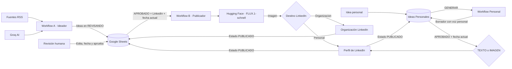

# Mapa de la solución

Este documento es la fuente conceptual que Graphify incorpora al grafo junto con los workflows de n8n.



## Componentes

- `Workflow_A_Ideador_Empresa.json`: obtiene noticias, genera el contenido y crea filas en estado `REVISANDO`.
- `Workflow_B_Publicador_LinkedIn.json`: publicador principal; enruta a perfil u organización usando `Destino LinkedIn`.
- `Workflow_B_Publicador_LinkedIn_Organizacion.json`: variante independiente de compatibilidad para una organización configurada por el usuario.
- Google Sheets: base operativa y punto de aprobación humana.
- Groq AI: generación del copy, clasificación de funnel y prompt visual.
- Hugging Face FLUX.1: generación de la imagen del post.
- LinkedIn OAuth2: autorización del perfil o de la organización de destino.

## Reglas de operación

1. Sólo se publican filas con `Estado=APROBADO`, `RRSS=LinkedIn` y `Fecha Publicacion` igual a la fecha actual.
2. `Destino LinkedIn` sólo admite `Personal` u `Organizacion`; un valor vacío o diferente no se publica.
3. El publicador principal y la variante independiente son mutuamente excluyentes; no deben activarse simultáneamente sobre la misma hoja.
4. Después de una publicación exitosa, la fila se actualiza a `PUBLICADO` usando su `ID`.
5. `HUGGINGFACE_API_TOKEN` se configura como variable de entorno y nunca se almacena en los JSON.

## Consultas útiles en Graphify

Una vez generado `graphify-out/graph.json`:

```powershell
graphify query "¿Cómo llega una noticia hasta LinkedIn?"
graphify query "¿Qué componentes dependen de Google Sheets?"
graphify affected "Workflow_B_Publicador_LinkedIn_Organizacion.json"
graphify path "Workflow_A_Ideador_Empresa.json" "LinkedIn"
```
